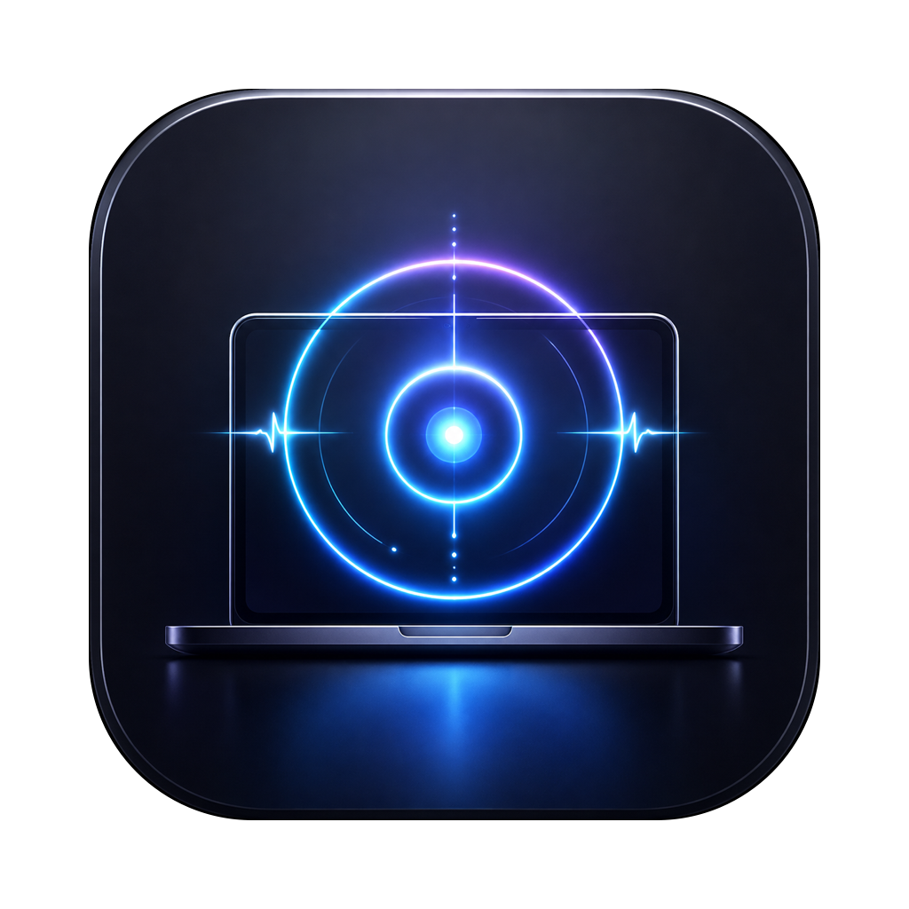
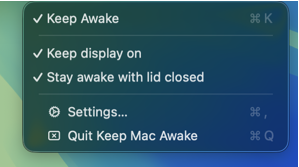
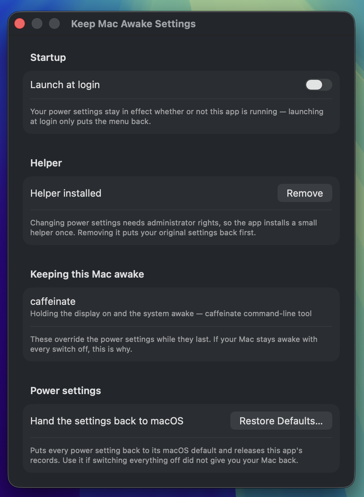

<div align="center">



# Keep Mac Awake

**A menu-bar app that stops your Mac from falling asleep — and keeps it that way
after you quit the app.**

[](https://github.com/kemalandic/keep-mac-awake/releases/latest)
[](#install)
[](#install)
[](LICENSE)



</div>

## Install

Download the latest `.dmg` from
[Releases](https://github.com/kemalandic/keep-mac-awake/releases), open it and
drag the app to Applications.

The build is signed and notarized, so there is no "unidentified developer"
warning. Drag it in Finder rather than copying it from a terminal — a
terminal copy triggers App Translocation, which breaks the helper.

Requires macOS 14 or later. Universal (Apple Silicon and Intel).

## The three switches

| Switch | What it does | System setting |
|---|---|---|
| **Keep Awake** | The Mac never sleeps on its own. The screen may still turn off. | `pmset -a sleep 0` |
| **Keep display on** | The screen stays on too. | `pmset -a displaysleep 0` |
| **Stay awake with lid closed** | Closing the lid does not put it to sleep. | `pmset -a disablesleep 1` |

They are independent switches. For "close the lid and keep working" you want the
first and the third: with the lid shut the Mac can still fall asleep for being
idle.

## Your settings stay put — and stay yours

Flip a switch and the setting is written into the system. Then it is held there:

- Quit the app: nothing changes
- The app crashes: nothing changes
- Reboot: your settings are still there
- Another app or script changes them: they are put back
- Only switching it off puts your machine back the way it was

The app does not need to be running. A small privileged helper does the holding,
and it keeps running whether the menu is open or not.

While a switch is on, that setting wins. What is *not* touched is anything you
did not switch on — if "Keep display on" is off, your display timeout is yours,
and nothing here will fight you over it.

The menu reads the current state from the system rather than remembering what it
last wrote, so it stays honest. When it cannot reach the helper it says so
instead of showing everything as off.

## Why it asks for approval once

Changing these settings needs root, and no entitlement lets a normal app do it.
Keep Mac Awake ships a small privileged helper for exactly this. The first time
you change a setting, macOS asks you to approve it in **System Settings ›
General › Login Items**. That happens once; after that the switches work
instantly, with no password prompts.

Before changing anything the helper records your machine's own values, and puts
them back when you switch everything off.



Settings also has a **Launch at login** switch — that only puts the menu back
after a restart. Your power settings are already in effect either way.

## How this differs from Amphetamine, Caffeine, KeepingYouAwake

Those apps hold an `IOPMAssertion`, which is tied to the process holding it.
That is a good design for what they are: the moment you quit, the Mac goes back
to normal, and nothing on your system has been altered.

Keep Mac Awake writes the setting instead. Different trade-off:

|  | Assertion-based apps | Keep Mac Awake |
|---|---|---|
| The app must keep running | Yes | No |
| Survives quit / crash / reboot | No | Yes |
| Changes system settings | No | Yes — restored when you switch off |
| Wins against another app changing them | n/a | Yes, while switched on |
| Needs an admin approval | No | Once, for the helper |
| Lid closed without an external display | Not possible | Yes |

Pick this one if you want to set it and forget it, or need the lid-closed case.
Pick one of those if you want something that never touches your system state.

## Known limitation

Choosing **Sleep** from the Apple menu still puts the Mac to sleep. These
settings prevent *idle* sleep, not a deliberate command. That is how macOS
works.

## Building from source

```bash
brew install xcodegen
xcodegen generate
xcodebuild -project KeepMacAwake.xcodeproj -scheme KeepMacAwake -destination 'platform=macOS' build
```

`KeepMacAwake.xcodeproj` is generated from `project.yml` and is not in git.

### Tests

```bash
# pure logic, safe anywhere
xcodebuild -project KeepMacAwake.xcodeproj -scheme KeepMacAwakeTests -destination 'platform=macOS' test

# plus tests that read the real machine
xcodebuild -project KeepMacAwake.xcodeproj -scheme KeepMacAwakeDeviceTests -destination 'platform=macOS' test
```

Device tests live behind a separate scheme rather than an environment variable:
`xcodebuild` does not forward shell environment into a host-less macOS test
bundle.

### Releasing a signed build

Needs an Apple Developer account — a *Developer ID Application* certificate and
notarytool credentials saved once:

```bash
xcrun notarytool store-credentials keep-mac-awake \
  --apple-id <id> --team-id <TEAMID> --password <app-specific-password>

./scripts/release.sh 1.1.2
```

The script bumps the version and build number, archives universal, exports with
Developer ID, notarizes and staples the app, then wraps it in a DMG and
notarizes and staples that too. Both stapling passes matter: without the first
one the copy dragged to `/Applications` carries no ticket of its own.

Override with `KMA_SIGN_IDENTITY`, `KMA_TEAM_ID`, `KMA_NOTARY_PROFILE` if the
defaults do not match your setup.

### Forking

Change `bundleIdPrefix`, the three `PRODUCT_BUNDLE_IDENTIFIER` values and
`DEVELOPMENT_TEAM` in `project.yml`, and rename
`Helper/ai.pakslab.keep-mac-awake.helper.plist` to match your helper's bundle
identifier — `SMAppService` requires the plist filename to equal the daemon's
`Label`.

## How it works

See [docs/architecture.md](docs/architecture.md) — the design decision behind
"settings outlive the app", and the macOS traps this code works around.

## Layout

```
App/      menu bar UI, settings window, app lifecycle
Core/     helper client, registration retry, login item, preferences
Helper/   privileged daemon: pmset control, the two stores, enforcement, XPC
Shared/   config type, XPC protocol and logging shared by both targets
Tests/    XCTest — pure logic plus device-gated checks
```

## License

MIT — see [LICENSE](LICENSE).
